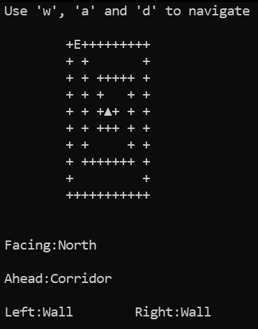
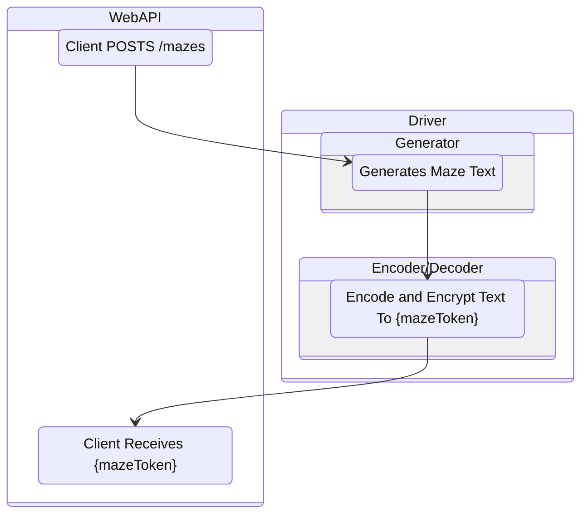
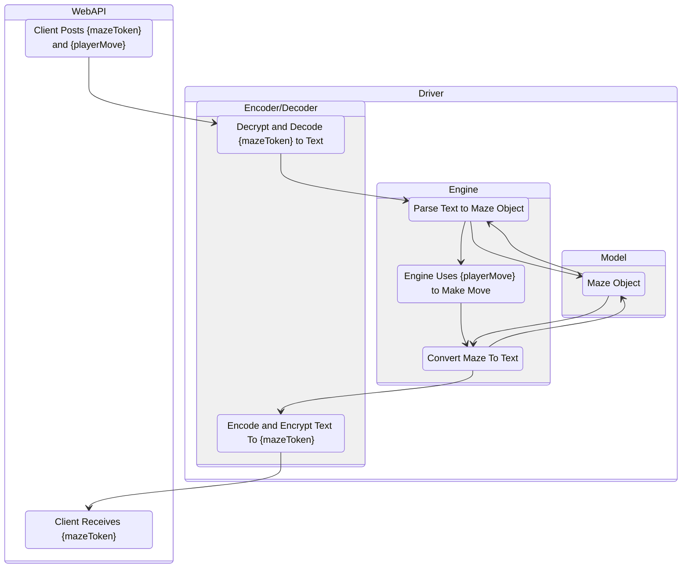
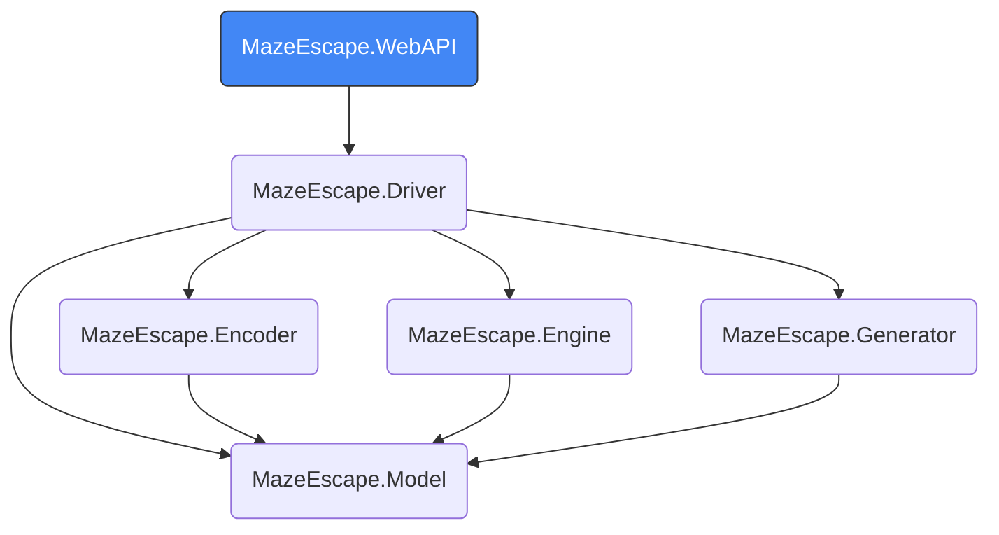
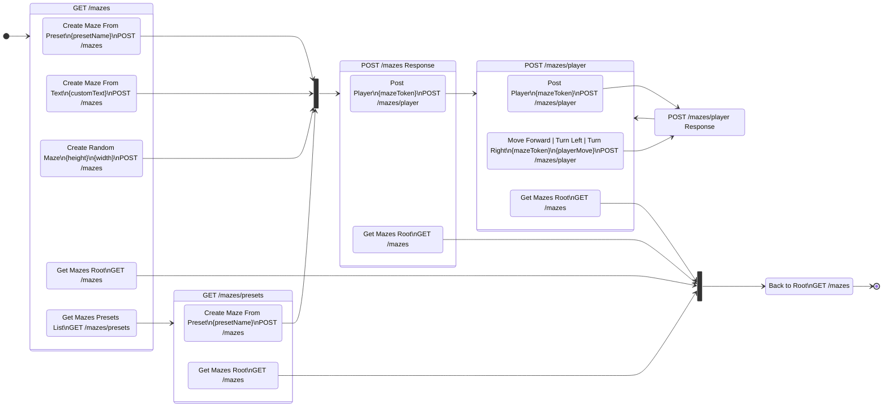
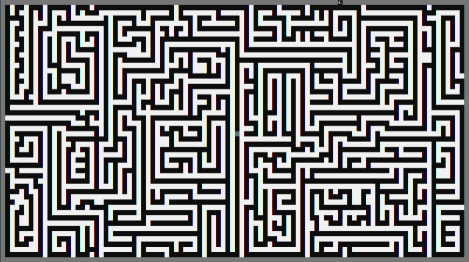
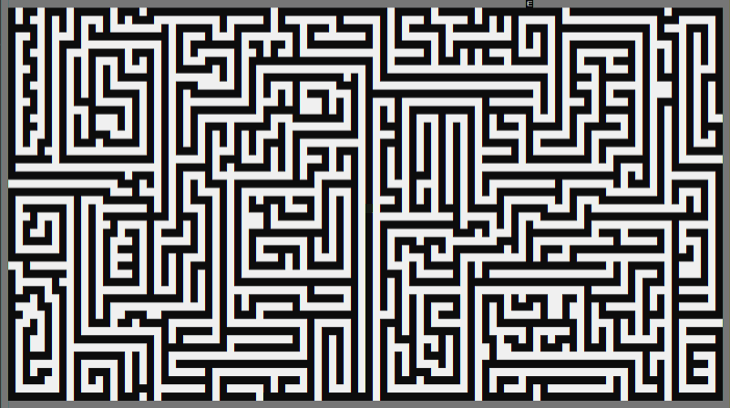

# MazeEscape

## Table of Contents
- [Introduction](#introduction)
- [Concept](#the-concept)
- [Project Structure](#project-structure)
- [BDD/TDD](#bddtdd)
- [The API](#the-api)
- [The Algorithm](#the-algorithm)
- [Further work](#further-work)

  


# Introduction

This project explores and demonstrates some software engineering concepts such as:
- Taking a BDD approach to building a REST API
- Making the API stateless, cacheable and utilising HATEOAS (hypermedia as the engine of application state) to make it discoverable and self-documenting
- Writing an algorithm to produce random mazes

<br>

The basic API definition is as follows:

- The client creates a new maze by posting to an endpoint
- The client receives a {mazeToken} in response. This contains all the information about the maze but its encrypted so the client cant "cheat"
- The client can now use the API to navigate the maze. Each call will return another {mazeToken} and information about what the player can see in the maze
- Each time the client makes a move, they include their maze token in the body of the request
- Each request response contains hypermedia which the client can use to make their next move

On each client move request the {mazeToken} is decrypted server-side and the next move is played. Then the maze is re-encrypted and sent back to the client. This way the API is completely stateless. There is no database and no session variables keeping track of any state. All the information necessary is encrypted in the maze token.

### Concepts Explored

- JSON REST API
- Hypermedia
- Encryption
- Algorithms
- BDD/TDD

### Technologies used

- C#
- .NET 8
- ASP.NET Core Web API
- SpecFlow
- NUnit
  
# The Concept

The life of this project began as a simple console app. After building the functionality to navigate an arbitrary maze the concept was ready for further development.




The maze is inputted in text form and then parsed into the object model. Using strings to represent mazes is a useful way of making them human readable and serialisable for transportation.

Five characters are used to define a new maze:
- <code>'+'</code> for walls 
- <code>' '</code> (space) for corridors
- <code>'S'</code> for the start point
- <code>'E'</code> for the exit
- <code>'\n'</code> for the end of a row of the maze

Additionally, when a maze is being played the arrow symbols are used to represent player location and direction <code>'▲''►''▼''◄'</code>

From here onwards I'll use the █ character to represent walls for convenience.
So the smallest valid maze which contains all characters would be:


<pre style="line-height:1.04;font-weight:bold;">
█E█
█ █
█S█
███
</pre>
This is our 'minmaze'. In string format it reads as:<br>
<code>+E+\n+ +\n+S+\n+++</code>

If we encode each character to a number and convert it to a base64 string then it encodes to:<br> 
<code>0BAIBAgUCAAo=</code>

Then we encrypt it using AES256 to get our {mazeToken}:<br>
<code>VNH10y5WfZU6pSsmjkuxdQ==jdm7MXbRcclJr34rsBqmmQ==</code>

The {mazeToken} can be passed to the client and is a permanent reference to a maze state. The client is unable to determine the structure of the maze from the token as the encryption key is stored server-side. This process is reversible, so the player can send a {mazeToken} to the API with a requested player move and that can be carried out.


### Maze Creation Workflow

- Client POSTS to /mazes endpoint with some creation parameters
- Maze Text is created

e.g.
  
<pre style="line-height:1.04;font-weight:bold;">
██████████
█        █
█ █ ████ █
█ █ █ ██ █
█ █ █ █  █
█ █ █S█ ██
█ ███ █  █
█   █ ██ █
█ █ █    █
███E██████
</pre>

- Turn text into {mazeToken} and return to client with position info

e.g.
```json
{
  "mazeToken": "+OyrCUXVFRJnyLVPzuKZzg==r5O9KyhtpJ5b5J8LYEdO84eZ4oC69fdAo...",
  "position": {
      "x": 1,
      "y": 1
    },
    "facing": "North",
    "vision": {
      "ahead": "Corridor",
      "left": "Wall",
      "right": "Wall"
    }
}
```

### Maze Creation Workflow Diagram



### Player Movement Workflow

- Client POSTS to /mazes/player endpoint

e.g.

```json
{
    "mazeToken": "CJ8xBWHq3To9T5lyNhLxWg==9TkWL6BxVDKNBt16LaNKerRsNMO1Ou..."
    "playerMove": "forward"
}
```


- Decrypts {mazeToken} to text
- Engine parses text and moves player forward


e.g.
<pre style="line-height:1.04;font-weight:bold;">
██████████           ██████████
█        █           █        █
█ █ ████ █    Move   █ █ ████ █
█ █ █ ██ █  Forward  █ █ █ ██ █
█ █ █ █  █    ==>    █ █ █ █  █
█ █ █▼█ ██           █ █ █ █ ██
█ ███ █  █           █ ███▼█  █
█   █ ██ █           █   █ ██ █
█ █ █    █           █ █ █    █
███E██████           ███E██████
</pre>
- Turn text into {mazeToken} and return to client with position info

e.g.

```json
{
  "mazeToken": "+OyrCUXVFRJnyLVPzuKZzg==r5O9KyhtpJ5b5J8LYEdO84eZ4oC69fdAo...",
  "position": {
      "x": 5,
      "y": 6
    },
    "facing": "South",
    "vision": {
      "ahead": "Corridor",
      "left": "Wall",
      "right": "Wall"
    }
}
```

### Player Movement Workflow 



</br>

# Project Structure

The project consists of the following components:

- **MazeEscape.WebAPI**
  - WebAPI to interface with the client
- **MazeEscape.Driver**
  - Coordinates the components for use by the WebAPI
- **MazeEscape.Engine**
  - Parses mazes from text into the domain model and back again. 
  - Moves the player around the maze
- **MazeEscape.Generator**
  - Creates random mazes as text
- **MazeEscape.Encoder**
  - Turns a maze in text format into an encrypted token and back again
- **MazeEscape.Model**
  - The domain model for the project. 

## Dependency Diagram



<br>

# BDD/TDD

Using BDD with SpecFlow can be a really powerful way to develop an API. Using the two features below give a large percentage of test coverage to the code base. Used in conjunction with NUnit for unit testing smaller components, enables directed development of features as well as the ability to fearlessly refactor and restructure code when it meets the requirements.

```gherkin
Feature: Player

Enpoint usage for navigating a maze as a player

Scenario: ErrorScenario: Get Player Info without mazeToken
	Given the MazeEscape client is running		
	When I make a POST request to:/mazes/player with body:{"mazeToken": ""}
	Then the status code is:BadRequest
	And the response contains error message:mazeToken is required

Scenario: Move player through the smallest maze
	Given the MazeEscape client is running
	When I make a POST request to:/mazes with body:{"createMode":"preset", "preset": {"presetName": "minmaze"}}
	And I save the mazeToken
	And I make a POST request to:/mazes/player with saved mazeToken and body:{"mazeToken":"{mazeToken}"}
	And I save the mazeToken
	And I make a POST request to:/mazes/player with saved mazeToken and body:{"mazeToken":"{mazeToken}","playerMove":"forward"}
	And I save the mazeToken
	And I make a POST request to:/mazes/player with saved mazeToken and body:{"mazeToken":"{mazeToken}","playerMove":"forward"}
	Then the response message contains:You escaped
```
```gherkin
Feature: RandomMaze

Enpoint usage for creating a random maze

Scenario: Create a random maze 
	Given the MazeEscape client is running
	When I make a POST request to:/mazes with body:{"createMode":"random", "random": {"width": 10, "height": 10}}
	Then the status code is:Created
	And the response data contains a non-null variable named:mazeToken
	And the response data contains an int named:width with value:10
	And the response data contains an int named:height with value:10	

Scenario: ErrorScenario: Create a random maze with missing height
	Given the MazeEscape client is running
	When I make a POST request to:/mazes with body:{"createMode":"random", "random": {"width": 10 }}
	Then the status code is:BadRequest
	And the response contains error message:width and height are required parameters

Scenario: ErrorScenario: Create a random maze with height and width out of range
	Given the MazeEscape client is running
	When I make a POST request to:/mazes with body:{"createMode":"random", "random": {"width": 51, "height": 51 }}
	Then the status code is:BadRequest
	And the response contains error message:width and height must be between 10 and 50
```

Several more feature files were created at the start of the project and were used for regression testing throughout.

As well as SpecFlow tests, NUnit tests were also used for component unit testing. This aids in development at the more granular level, particularly for intricate pieces of logic.

<br>

# The API


Status codes used:

 - 200 - OK
 - 201 - Created
 - 400 - Bad request
 - 404 - Not found
 - 500 - Internal server error   

The API consists of 4 simple endpoints based around the mazes resource. They are as follows:

### **GET /mazes**

This endpoint is the root of the API. As no mazes are stored server-side, it returns only hypermedia showing how to use the API.

### **POST /mazes**

Creates a new maze in one of three ways: preset, custom or random. A {mazeToken} is issued to the client on success.

### **GET /mazes/presets**

Returns a list of preset maze names which can be used to create a preset maze above.

### **POST /mazes/player**

On posting the {mazeToken} and an optional player move, information about the players location in the maze is returned.
As a maze only has one player, the player is a singleton, and therefore the singular term is used in the endpoint.

## Example Usage

Hypermedia has been excluded from these examples as it's addressed in the next section. 

### **POST /mazes**

```json
{
  "createMode": "preset",  
  "preset": {
    "presetName" : "spiral"
  }
}
```

Or
```json
{
  "createMode": "custom",  
  "custom": {
   "mazeText" : "+E+\n+ +\n+S+\n+++"
  }
}
```
Or
```json
{
  "createMode": "random",  
  "random": {
    "width": 20,
    "height": 20
  }
}
```
Response:
```json
{
  "data": {
    "mazeToken": "CJ8xBWHq3To9T5lyNhLxWg==9TkWL6BxVDKNBt16LaNKerRsNMO1Ou...",
    "width": 20,
    "height": 20
  }
  ... 
}
```

### **GET /mazes/presets**

Response:
```json
{
  "data": [
    "minmaze",
    "spiral"
  ]
  ...
}
```

### **POST /mazes/player**

```json
{
  "mazeToken": "{mazeToken}",
  "playerMove": "{playerMove}"
}
```

Response:
```json
{
  "data": {
    "mazeToken": "+OyrCUXVFRJnyLVPzuKZzg==r5O9KyhtpJ5b5J8LYEdO84eZ4oC69fdAosVsICdv69FZiVh8e...",
    "position": {
      "x": 6,
      "y": 7
    },
    "facing": "North",
    "vision": {
      "ahead": "Exit",
      "left": "Wall",
      "right": "Wall"
    },
    "info": "",
    "isEscaped": false
  }
  ...
}
```

## Hypermedia

The following state diagram depicts how the hypermedia returned for each endpoint directs the client to link to the next. 




### **GET /mazes**

This is the API root and returns only hypermedia as follows:

Actions:
- Create maze from preset
- Create maze from text
- Create random maze

Links:
- Get mazes root
- Get mazes presets list

```json
{
  "actions": [
    {
      "description": "create-maze-from-preset",
      "href": "/mazes",
      "method": "POST",
      "body": {
        "createMode": "preset",
        "preset": {
          "presetName": "{presetName}"
        }
      }
    },
    {
      "description": "create-maze-from-text",
      "href": "/mazes",
      "method": "POST",
      "body": {
        "createMode": "custom",
        "custom": {
          "mazeText": "{mazeText}"
        }
      }
    },
    {
      "description": "create-random-maze",
      "href": "/mazes",
      "method": "POST",
      "body": {
        "createMode": "random",
        "random": {
          "width": "{width}",
          "height": "{height}"
        }
      }
    }
  ],
  "links": [
    {
      "description": "get-mazes-root",
      "href": "/mazes",
      "method": "GET"
    },
    {
      "description": "get-mazes-presets-list",
      "href": "/mazes/presets",
      "method": "GET"
    }
  ]
}
```
### **POST /mazes**
Posting one of the maze creation actions from above will give the following:

Action:
- Post player
  
Link:
- Get mazes root
```json
{
  "data": {
    "mazeToken": "o17ma/vu++qNaw0HWA4PqA==p33mGcB637pqaD//VBE3inIgdJlczTOGM...",
    "width": 20,
    "height": 20
  },
  "actions": [
    {
      "description": "post-player",
      "href": "/mazes/player",
      "method": "POST",
      "body": {
        "mazeToken": "{mazeToken}"
      }
    }
  ],
  "links": [
    {
      "description": "get-mazes-root",
      "href": "/mazes",
      "method": "GET"
    }
  ]
}
```

### **POST /mazes/player**
Posting the player as above will give the following:

Actions:
- Post player
- Player turn left
- Player turn right
- Player move forward
  
Link:
- Get mazes root

```json
{
  "data": {
    "mazeToken": "6TUFkRO4FQNjopObENk5yA==nU77dAAzR65ev3eJGVtO3p5C1Ao9PMglZuo...",
    "position": {
      "x": 10,
      "y": 10
    },
    "facing": "North",
    "vision": {
      "ahead": "Wall",
      "left": "Corridor",
      "right": "Wall"
    },
    "info": "",
    "isEscaped": false
  },
  "actions": [
    {
      "description": "post-player",
      "href": "/mazes/player",
      "method": "POST",
      "body": {
        "mazeToken": "{mazeToken}"
      }
    },
    {
      "description": "player-turn-left",
      "href": "/mazes/player",
      "method": "POST",
      "body": {
        "mazeToken": "{mazeToken}",
        "playerMove": "turnLeft"
      }
    },
    {
      "description": "player-turn-right",
      "href": "/mazes/player",
      "method": "POST",
      "body": {
        "mazeToken": "{mazeToken}",
        "playerMove": "turnRight"
      }
    },
    {
      "description": "player-move-forward",
      "href": "/mazes/player",
      "method": "POST",
      "body": {
        "mazeToken": "{mazeToken}",
        "playerMove": "forward"
      }
    }
  ],
  "links": [
    {
      "description": "get-mazes-root",
      "href": "/mazes",
      "method": "GET"
    }
  ]
}
```

## Hypermedia Console App Demo

The following is a demo navigating the hypermedia of the API. The code can be found in the Demos folder of the project: MazeEscape.HypermediaDemo

Other than the fact that the {mazeToken} needs to be passed back to the API when needed, the demo code knows nothing about the API structure (though I did add some keyboard shortcuts at the end to help with maze navigation).

We can replicate our proof of concept functionality using the API hypermedia to direct us to the correct endpoints.


# The Algorithm

The maze generating algorithm works by keeping track of unvisited squares in the maze. Because of this it has a complexity of O(n). The work flow is as follows:

Rules:

 - Move onto unvisited squares only 
 - Don't build over any corridors
 - Change direction if: 
   - You can't move forward any further  
   - At random
 - If you can't move in any direction teleport to a corridor next to an unvisited square

Steps:

 - Move forward into an unvisited square 
   - Build a corridor on the current square
   - Build walls on the left and right sides
   - Remove the built-on squares from the unvisited list
- Change direction according to rules
- Repeat until there are no unvisited squares on the current path


There will be some edge cases with this algorithm which have to be dealt with separately but this is the basic idea. 

The below animations were created using the MazeEscape.GeneratorDemo console application which is included in the Demos section of the codebase. 


[Here is a gif of a big maze being built](./Images/big-maze-build.gif). Its quite large (around 100mb) so I didn't put it on this page.

Due to not building over corridors and backtracking to adjoining unvisited squares, all corridors will be connected to each other and there will be no isolated bits of maze.

This means we can theoretically place the exit in any corridor and it will join up to the start point. For now we will pick a random border square next to a corridor for the exit. This mostly works ok, but sometimes the route to the exit is a bit short.

Here are some examples of varying exit route length.


# Further Work

The maze generating algorithm has the potential for much further development. Even small changes in the variables used in the algorithm have a big impact on the character and aesthetic of the maze. As such there is the possibility to develop a far more detailed maze generator with many extra inputs to define each one. Additional work could include:

- Further refactoring and componentisation of the algorithm
- A set of tests built for each component
- Strategies which combine the components in various ways to provide different maze types

A JavaScript frontend could also be of use here to bring the whole project together. Due to the cacheability of the {mazeToken} maze searching and pathfinding in the browser in interesting ways could be possible. Any point in the maze can be returned to by resubmitting the {mazeToken} allowing the client to teleport back to points of interest.

## Misc. Demos

As a breadth-first search is used to calculate the shortest route to the exit in the unit-testing code, I repurposed some of it to demonstrate the searching of a maze.

Here is a comparison of a breadth-first search and a depth-first search of the same maze. 

Breadth-first search



Depth-first search



We can see how the breadth-first search is a clear winner for this type of maze (though memory intensive). This is partially because of the exit placement which is always at the border. If the exit was at the end of a long winding dead-end then the depth-first search might do better at least some of the time.

